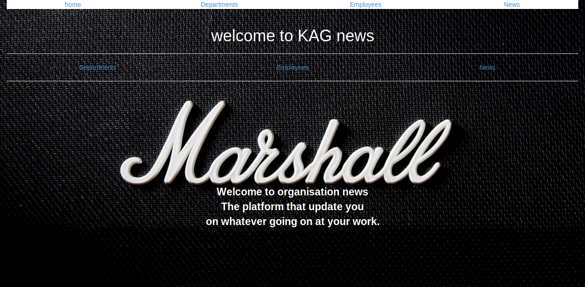

# Organisational-API

## Author 

KARAMBIZI Amandine Gloria

## Contents are the following

 - [x] App description
 - [x]  Technologies used
 - [x]  Installation
 - [x]  Contacts
 - [x]  License
### APPLICATION DESCRIPTION
 
 This application will allow the user to update the cpmpany about what is going on and who is doing what. I t gives news to every body in the company . 
  
### TECHNOLOGIES USED
 
   + IntelliJ IDEA Community Edition
   + classes with extension java 
   
### Setup
 
   1. Install  IntelliJ IDEAL Community Edition
   2. Clone this repository
   3. Open it within IntelliJ 
   
   + CREATE DATABASE organisationapi;
   + \c organisationapi;
   + CREATE TABLE departements (id serial PRIMARY KEY, name varchar);
   + CREATE TABLE users (id serial PRIMARY KEY, name varchar, health varchar, age varchar);
   + CREATE TABLE news (id serial PRIMARY KEY, location varchar, ranger_name varchar,date date);
   + CREATE TABLE IF NOT EXISTS user_in_departements (id serial PRIMARY KEY ,userId INTEGER,departementsId INTEGER
                                                                                                            );
 ### Picture of Application 
     

      
     
     
    
### CONTACTS
    
   +  Email:karambiziga@gmail.com
   +  Phone.Nbr:+250782398092 
    
     
### LISENCE

- [x] Copyright: [2019] Karambizi Amandine Gloria

